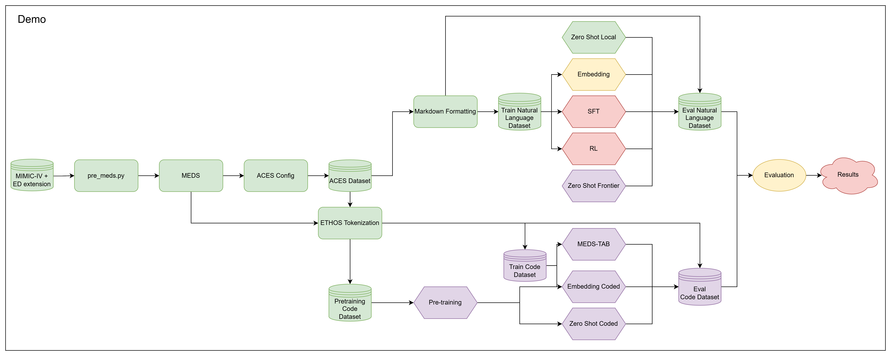

# Foresight-R

Aim is to fill in this results (tasks from MIMIC-ED benchmark) table:

| Model | Critical Outcome | ED Reattendance | Hospitlisation | Average |
| --- | --- | --- | --- | --- |
| Meds Tab |  |  |  |  |
| Ethos Zero Shot |  |  |  |  |
| Ethos Embedding |  |  |  |  |
| Frontier LLM Zero Shot |  |  |  |  |
| Frontier LLM Embedding? |  |  |  |  |
| Local LLM Zero Shot |  |  |  |  |
| Local LLM Embedding |  |  |  |  |
| LLM SFT |  |  |  |  |
| LLM GRPO |  |  |  |  |

This is a rough map of the codebase and where we are up to (running locally on mimic-iv-demo dataset):



- Green: Done
- Yellow: In progress
- Red: Not started
- Purple: Linglong?

## Install
```
uv sync
uv run pre-commit install
```
Download mimic-iv-demo with ed extension (copies ed directory into mimic directory)
```
export MIMIC_USER=your_username
export MIMIC_PASSWORD=your_password
make download-demo-data
```

## To run locally

### Preprocessing
```bash
make meds
make aces-labels
make nl-dataset
```

### Local Zero Shot
```bash
make zero-shot-inference
```

### Local Embedding
```bash
make embedding-train
make embedding-inference
```
