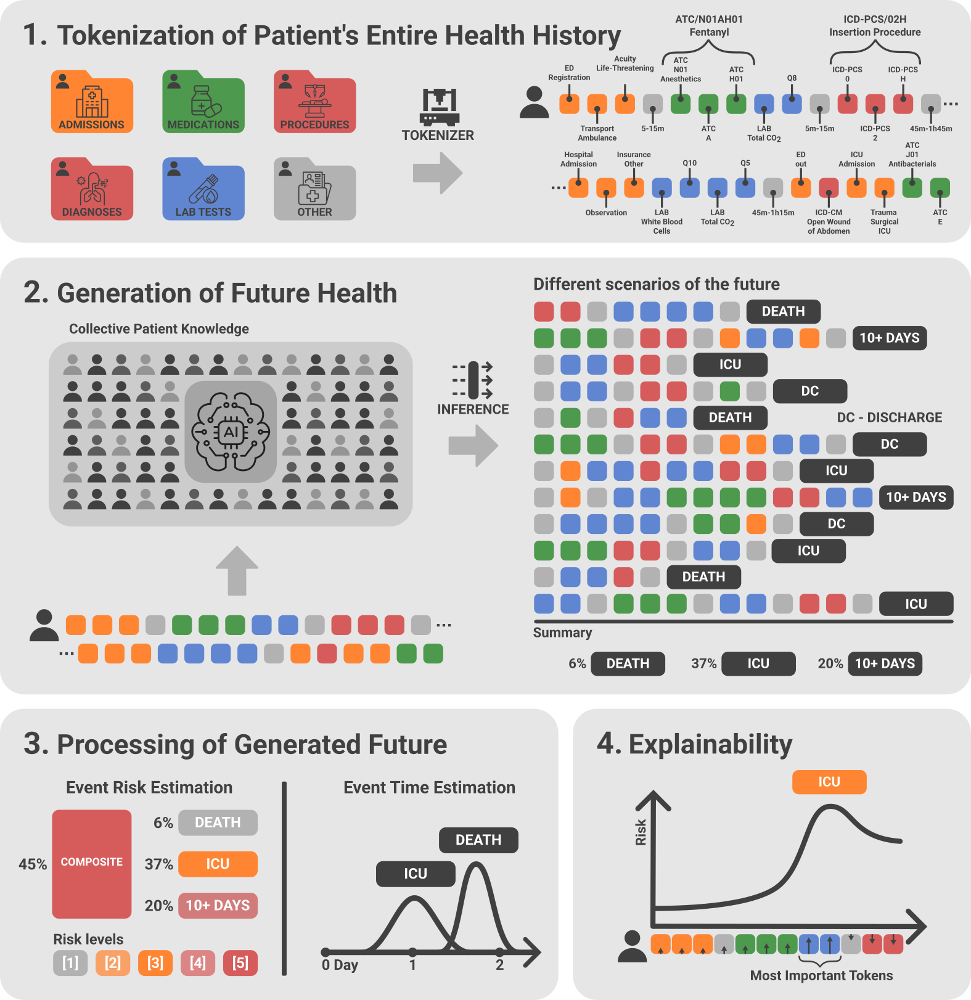

> [!IMPORTANT]
> The code in this directory is sourced from [ipolharvard/ethos-ares](https://github.com/ipolharvard/ethos-ares/tree/2d54383997318eb52f3d47b5969a66fc166b71ff).

> [!NOTE]
> All data files in the `src/ethos/tokenize/maps` directory are under the CC0 public domain waiver.

# ETHOS - EHR foundation model

This repository implements Adaptive Risk Estimation System (ARES) for Hospital Mortality, ICU
Admission, Prolonged Length of Stay, and Composite (HM+IU+PLoS). In addition, it contains all the
experiments conducted in our paper ([preprint](https://arxiv.org/abs/2502.06124)). It builds on our
previous work on EHR foundation models by completely
reimplementing [ETHOS](https://www.nature.com/articles/s41746-024-01235-0) (formerly
available [here](https://github.com/ipolharvard/ethos-paper)) to achieve higher performance, improved usability and robustness.

## Features

- In this release, we demonstrate that ETHOS outperforms the baselines presented in our paper and
  introduce ARES, a method for explaining patient health trajectories. We test ETHOS on the MIMIC-IV
  with the MIMIC-IV-ED extension dataset on all most common tasks in the domain.
- A key feature of ETHOS is zero-shot prediction, where known patient health trajectories are
  extrapolated to generate future patient health trajectories (fPHT). This process is repeated to
  derive probability estimates.
- The current main model architecture that we use is GPT2 (no bias). Feel free to experiment
  with architectures specifically suited for EMR.
- ETHOS is not a natural language model. It uses a specialized language designed to succinctly
  describe patient health events, which we believe helps the model learn better representations and
  token relationships.
- This implementation uses [MEDS](https://github.com/Medical-Event-Data-Standard/meds) as an
  intermediate data representation.
- We provide a full pipeline that includes tokenization, training, and inference.
- We invite everyone to a discussion in the Issues section of this repository.

<p align="center">
<a href="https://arxiv.org/abs/2502.06124">
  
</a>
</p>

## Paper reproducibility

We provide the complete code necessary to reproduce all experiments presented in the paper.

Additionally, all precomputed inference results of our experiments are available in
`results.tar.gz` [[GigaDB (1.1GB)]](https://doi.org/10.5524/102752).
Once unpacked in the project's root directory, this file will allow generating
all the figures in the paper using the notebooks: `notebooks/figures.ipynb` and
`notebooks/trajectories.ipynb`. The test set on which these results were inferred can be easily
recreated by running the MEDS extraction and tokenization pipelines (see below). MEDS guarantees the
same data split if run on the same data with the same configuration (see `scripts/meds`).

We do not publish the tokenized dataset or the pretrained model due to restrictions on MIMIC
derivatives, and we conclude that these components are not suitable for publication on PhysioNet.

## Pre-tokenization step

ETHOS tokenization uses an intermediate
format [MEDS](https://github.com/Medical-Event-Data-Standard/meds), extracted via
the [MEDS_transforms](https://github.com/mmcdermott/MEDS_transforms) pipeline. Scripts for running
this pipeline are located in `scripts/meds`.

Below is an example command to run the extraction (where `$suffix` should be "ed" or empty). In case
of `ed`, it requires the MIMIC-IV-ED extension to be present in the input directory:

```bash
export N_WORKERS=7

# Please define output_dir, strongly suggested is <PROJECT_ROOT>/data
suffix="ed" # or ""

bash run_mimic.sh \
    "$MIMIC_IV_DIR" \
    "$output_dir/mimic-2.2-premeds" \
    "$output_dir/mimic-2.2-meds-$suffix" \
    "$suffix"
```

Note, that using 7 workers for the tokenization requires around 250GB of RAM peak usage. You can
reduce the memory requirement by reducing the number of workers.

In the [paper](https://arxiv.org/abs/2502.06124), data is split into 90% training and 10% testing.
It can be adjusted in the `scripts/meds/mimic/configs/extract_MIMIC.yaml` file. Note, that keys:
`train`, `tuning` and `held_out` have to be always present in the config file, but can be set to
null.

```yaml
split_and_shard_subjects:
    ...
    split_fracs:
        train: 0.9
        test: 0.1
        tuning: null
        held_out: null
```

Once, the data extraction is complete, you can tokenize using the `ethos_tokenize` command, demonstrated
in `scripts/run_tokenization.sh`. Ensure the file hierarchy matches what the script expects, or
modify the script accordingly before running.

## Installation

[Optional] We strongly encourage the use of a virtual environment, for example, Conda:
To create a new conda env:

```bash
conda create --name ethos python=3.12
conda activate ethos
```

Fetch the project and set it up in the development mode (`-e`) and install all necessary
dependencies for running notebooks and scripts by executing:

```bash
git clone https://github.com/ipolharvard/ethos-ares
cd ethos-ares
pip install -e .[jupyter]
```

## Package Scripts

After installing the package, the below commands will become available for running from the command line.

1. `ethos_tokenize` - tokenizes data in the MEDS format into Patient Health Timelines.

Example of tokenization with parameters used for MIMIC-IV.

```bash
ethos_tokenize -m worker='range(0,7)' \  # spawns 7 workers
    input_dir=$input_dir/train \  # `input_dir` is the path to the MEDS data
    output_dir=$output_dir \
    out_fn=train

ethos_tokenize -m worker='range(0,2)' \
    input_dir=$input_dir/test \
    vocab=$output_dir/train \  # uses vocab created on the training split
    output_dir=$output_dir \
    out_fn=test
```

See the full example in `scripts/run_tokenization.sh`.

2. `ethos_train` - runs the model training.

Example of training a model in the 8GPU setting.

```bash
torchrun --no_python --standalone --nproc_per_node=8 ethos_train \
  data_fp=$data_path/train \
  val_size=6 \ # uses the last 6M tokens of train as the validation dataset
  batch_size=$BATCH_SIZE \
  max_epochs=300 \
  out_dir="$data_path/models/${model_name}" # the path to save model checkpoints
```

See the full example in `scripts/run_training.sh`.

3. `ethos_infer` - runs the inference of a chosen downstream tasks.

Example of running the zero-shot inference for the 30-day readmission task with 32 repetitions per sample in the 8GPU setting.

```bash
ethos_infer \
    task=readmission \ # see ethos.inference.constants for all available tasks
    model_fp=$model_dir/$model/best_model.pt \
    input_dir=$dataset_dir/test \
    output_dir=results/$task_name/$dataset_$model \
    output_fn=rep_size_32_\$(date +%Y-%m-%d_%H-%M-%S) \
    rep_num=32 \
    n_gpus=8
```

Example of running the zero-shot inference for the ICU admission task on the random 40% of the whole test set.

```bash
ethos_infer \
    task=icu_admission \
    model_fp=$model_dir/$model/best_model.pt \
    input_dir=$dataset_dir/test \
    output_dir=results/$task_name/$dataset_$model \
    output_fn=rep_size_8\$(date +%Y-%m-%d_%H-%M-%S) \
    rep_num=8 \
    subset=0.4
```

Example of generating a synthetic dataset with the same demographic properties as the `train` dataset. Requires the `ethos_synth` step to convert it into a fully-fledged dataset that can be used for training.

```bash
ethos_infer \
    task=synthetic \
    model_fp=$model_dir/$model/best_model.pt \
    input_dir=$dataset_dir/train \
    output_dir=results/$task_name/$dataset_$model \
    output_fn=synthetic_\$(date +%Y-%m-%d_%H-%M-%S) \
    save_generated_tokens=true \ # it is crucial to saves the trajectories
    n_gpus=8
```

See the full example in `scripts/run_inference.sh`.

## Cite us

If you use ETHOS or ETHOS-ARES in your research, please cite our work:

[[1]](https://arxiv.org/abs/2502.06124)
Renc, P., Grzeszczyk, M. K., Oufattole, N., Goode, D., Jia, Y., Bieganski, S., ... & Sitek, A. (
2025).
Foundation Model of Electronic Medical Records for Adaptive Risk Estimation. arXiv preprint arXiv:
2502.06124.

```
@article{10.1093/gigascience/giaf107,
    author = {Renc, Pawel and Grzeszczyk, Michal K and Oufattole, Nassim and Goode, Deirdre and Jia, Yugang and Bieganski, Szymon and McDermott, Matthew B A and Was, Jaroslaw and Samir, Anthony E and Cunningham, Jonathan W and Bates, David W and Sitek, Arkadiusz},
    title = {Foundation model of electronic medical records for adaptive risk estimation},
    journal = {GigaScience},
    volume = {14},
    pages = {giaf107},
    year = {2025},
    month = {09},
    issn = {2047-217X},
    doi = {10.1093/gigascience/giaf107},
    url = {https://doi.org/10.1093/gigascience/giaf107},
    eprint = {https://academic.oup.com/gigascience/article-pdf/doi/10.1093/gigascience/giaf107/64443371/giaf107.pdf},
}
```

[[2]](https://www.nature.com/articles/s41746-024-01235-0)
Pawel Renc, Yugang Jia, Anthony E Samir, Jaroslaw Was, Quanzheng Li, David W Bates, Arkadiusz Sitek,
"Zero shot health trajectory prediction using transformer" npj Digital Medicine, 19 Sep 2024

```
@article{renc_zero_2024,
	title = {Zero shot health trajectory prediction using transformer},
	volume = {7},
	copyright = {2024 The Author(s)},
	issn = {2398-6352},
	url = {https://www.nature.com/articles/s41746-024-01235-0},
	doi = {10.1038/s41746-024-01235-0},
	language = {en},
	number = {1},
	urldate = {2024-09-24},
	journal = {npj Digital Medicine},
	author = {Renc, Pawel and Jia, Yugang and Samir, Anthony E. and Was, Jaroslaw and Li, Quanzheng and Bates, David W. and Sitek, Arkadiusz},
	month = sep,
	year = {2024},
	pages = {1--10},
}
```
